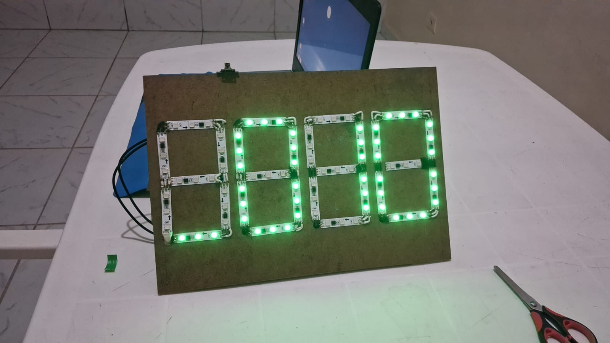

# Final-Countdown

Código do Final Countdown, um timer voltado para seminários com funcionalidades de personalização e controle do tempo desenvolvido como projeto final da matéria "Introdução à Engenharia da Computação" da turma 2024.2 do curso de graduação de Engenharia da Computação da UFPB ministrada pelo Prof. Anand Subramanian.

O projeto é composto pelo timer, a estrutura mostrada acima e um controle remoto.

Inicialmennte, o timer começa no modo MENU com o digito mais a esquerda piscando. Esse modo é usado para inserir o tempo de cada apresentação. Com o controle é possivel especificar o digito para alteração(o digito piscante) com as setas horizontais, aumentar ou diminuir uma unidade do dígito selecionado com as setas verticais(ex: o digito das dezenas dos segundos está selecionado então o incremento é feito de 10 em 10 segundos, se a unidade dos minutos é selecionada, o incremento é de 1 em 1 minuto), selecionar um númro para substituir o digito selecionado e avançar uma casa para a direita para que o usuario possa inserir rapidamente o tempo desejado e por fim, o botão "OK" inicia o modo TIMER.

Ao Clicar no botão "OK" o timer ficará azul indicando que ele está pausado, clicar novamente o botão iniciará uma sequência de 3 2 1 com aviso sonoro e, ao final, começará a decrementar o timer(é possível despausar o timer sem a sequência ao clicar o botão zero). Clicar o botão "*" volta para o modo MENU, o botão "#" reseta o timer ao tempo informado no menu e pausa o timer, o botão "OK" pausa o timer, as setas horizontal fazem o incremento/decremento de 15 em 15 segundos e as setas verticais fazem o incremento/decremento de 1 emm 1 minuto. Do tempo máximo ao tempo mínimo o timer assume um degrade de verde a vermelho. Há um aviso sonoro aos 1 minuto, nos três ultimos segundos, e ao finalizar o timer. Ao terminar o timer, ele passa a incrementar com a adição de um simbolo "-" na casa mais a direita indicando quanto tempo o palestrante ultrapassou do tempo informado. No tempo extendido, o timer faz um aviso sonoro a cada minuto.

Para o projeto, utilizamos:
- 1 Arduino Uno;
- 1 metro de fita led endereçavel WS2811;
- 1 buzzer
- 1 sensor infravermehlho;
- 1 controle remoto;

Usamos o Arduino Uno para controlar 4 digitos feitos com a fita led. Cada digito foi feito usando 7 segmentos da fita led em série. O buzzer foi usado para fazer os avisos sonoros.

O projeto foi inicialmente simulado na plataforma Tinkerkad para o desenvolvimento colaborativo. Com a chegada dos componentes e o avanço do código, passamos a testar no próprio equipamento.

O projeto foi desenvolvido por:

- https://github.com/DanielGrey1000
- https://github.com/ScarlattiMoura
- https://github.com/Segunddo
- https://github.com/Vinil4
- https://github.com/UmMarinheiro
